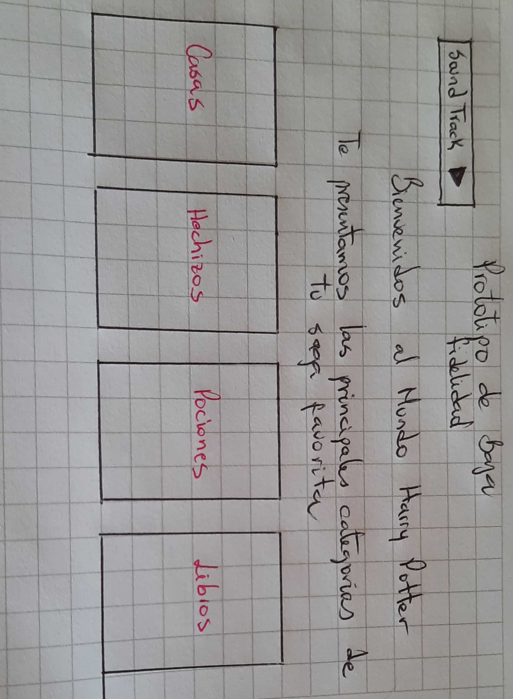
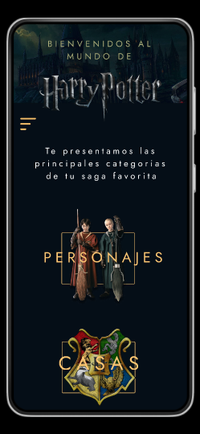

# Data Lovers

## Índice

* [1. Resumen del Proyecto](#1-resumen-del-proyecto)
* [2. Historias de Usuario](#2-historias-de-usuario)
* [3. Prototipo de Baja Fidelidad](#3-prototipo-de-baja-fidelidad)
* [4. Prototipo de Alta Fidelidad](#3-prototipo-de-alta-fidelidad)
* [5. Test de Usabilidad](#3-test-de-usabilidad)

***

## 1. Resumen del Proyecto

En este proyecto se tiene como principal objetivo procesar data, desplegandola
traves de una _interfaz_ amigable y entendible para el usuario. La forma en la que
se proceso el conjunto de datos fue manipulandola para poder visualizarla, ordenarla
y filtrarla. 

La data elegida en este proyecto fue sobre Harry Potter.

## 2. Historias de Usuario

* HU 1. Visualizar data

_"Yo como seguidora de la franquicia de Harry Potter, quiero visualizar un catálogo que me muestre categorías como personajes, casas, hechizos, pociones y libros , para complementar mis conocimientos como fan."_

- [ ] Mercury
- [x] Venus

* HU 2. Filtrar data

_"Yo como fan de Harry Potter, quiero filtrar los personajes por casa, para poder identificar características en común de los estudiantes que admite cada una."_

* HU 3. Ordenar data

_" Yo como espectador de Harry Potter, quiero ver las pociones por orden alfabético para poder consultarlas y conocer mas de ellas."_

* HU 4. Calculo agregado

_"Yo como usuaria, quiero saber el promedio de mujeres y hombre y el total de estudiantes en las casas , para conocer la inclusión de las mujeres en Hogwarts."_

## 3. Prototipo de Baja Fidelidad

Los primeros prototipos de baja fidelidad, buscando una buena distribución de cada uno de los elementos.

A traves del feedback que recibimos, agregamos algunos cambios mostrados a continuación:

## 4. Prototipo de Alta Fidelidad

Links

  * [Version Desktop](https://www.figma.com/file/n0PUF45bqgsd5wmmd5KFt6?node-id=0:1&comments-enabled=1&viewer=1&locale=en)

* [Version Responsive](https://www.figma.com/file/n0PUF45bqgsd5wmmd5KFt6?node-id=81:2&comments-enabled=1&viewer=1&locale=en)

El prototipo completo de alta fidelidad: link

## 5. Test de Usabilidad

Se realizaron diferentes test de usabilidad para detectar errores o inconvenientes que el usuario
podria presentar en el momento de navegar en el sitio web.

Los problemas que se detectaron en los test de usabilidad fueron los siguientes:

Version Desktop:

* Algunos textos no estaba centrados, y eso no era visualmente comodo para el usuario.
* Los colores empleados en la lista de las pociones no combinaba con el resto de la página.
* Las cards de personajes que no presentaban una imagen adherida se veian muy vacias.

Versión responsive:

* El tamaño de la letra era demasiado grande por lo que las palabras salian de los limites de la 
  pantalla.
* Algunas imagenes ocupaban mucho tamaño, por lo que el usuario presentaba problemas de navegación
 al tener que desplegarse de manera horizontal para visualizar toda la imagen.
* El icono x para cerrar el menu desplegable no era visible.
* Se presentarón modificaciones de estilos al visualizar la página en diferentes dispositivos celulares:
  las imagenes sobrepuestas una sobre otra se acomodaban de diferente forma. 

El proyecto fue iterando a traves de todos estos problemas detectados, dandoles solución y llegando asi a la versión final.
